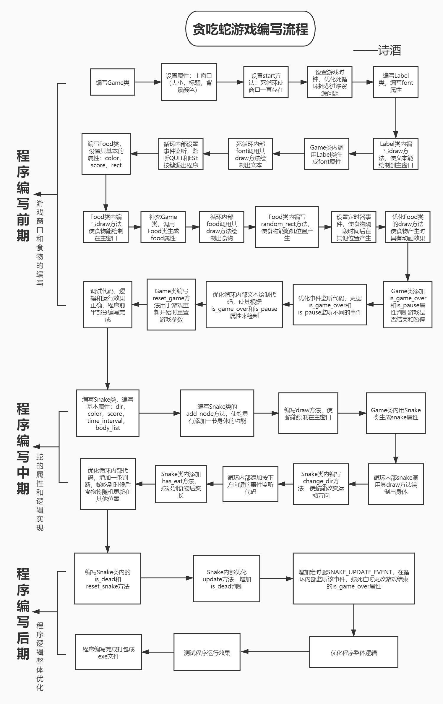

# 程序说明
    - 贪吃蛇游戏，游戏玩法和典型的贪吃蛇游戏一致
        - 30s内没有吃到食物则食物会刷新在其他地方
        - 吃食物可变长，随着长度的变长运行速度逐渐加快
        - 蛇头碰到墙体或身体游戏失败
    - 上下左右方向键控制蛇的移动
    - 按空格键暂停或重新开始游戏
    - 按ESC键或点击窗口关闭键可退出程序

# 程序编写流程

# 程序有关类的设计
    - 游戏类(Game)： 负责提供整个游戏流程控制的相关操作包括：
        - 创建游戏主窗口和游戏时钟
        - 创建并显示游戏元素：蛇、食物、得分标签、提示标签
        - 监听用户交互并做出相应处理
    - 标签类(Label)：负责提供文本提示信息的相关操作
    - 食物类(Food)：负责提供食物对象的相关操作
    - 蛇类(Snake)：负责提供蛇对象相关操作

# 类详情
    - Game
        - main_window   游戏主窗口
        - score_label   得分标签
        - tip_label     提示标签
        - is_game_over  结束标记
        - is_pause      暂停标记
        - food          食物
        - snake         贪吃蛇
        
        - reset_game    重置游戏
        - start         开始游戏
        
    - Label
        - font          绘制文本的字体
        - is_score      是否分数文本
        
        - draw          在游戏窗口绘制文本
        
    - Food
        - color         食物颜色
        - score         一颗食物的分数
        - rect          食物矩形区域
        
        - random_rect   随机设置位置
        - draw          在游戏窗口绘制食物
        
    - Snake
        - dir           运动方向
        - time_interval 运动时间间隔
        - score         游戏得分
        - color         身体颜色
        - body_list     身体列表
        
        - reset_snake   重置蛇属性
        - add_node      添加一节身体
        - draw          在游戏窗口上绘制身体
        - update        移动蛇的身体
        - change_dir    改变方向
        - is_dead       是否死亡
        - has_eat       是否迟到食物
 